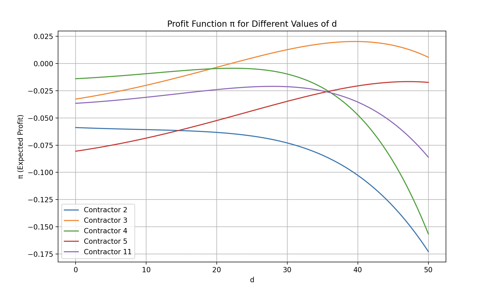

# Optimizing number of push notifications
A small example on optimizing the number of optimization using a [CATE estimator](https://matheusfacure.github.io/python-causality-handbook/18-Heterogeneous-Treatment-Effects-and-Personalization.html).  

### Problem statement
We would like to estimate the number of notifications ($D = d$) that you would like to send to a user in order to maximize the expected conversion. For example, you can think on notifications of a CRM campaign to promote a membership program / premium subscription.

At the same time, overusing the notifications can make users block the notifications of the app, resulting in an elevated cost for future CRM campaigns.

### Model proposal (ATE) non-heterogenity 

In order to solve this problem, we want to estimate  $\hat{\tau}(D=d)$ that represents the effect of the treatment $D=d$ on the population. For the sake of the example let's think on CRM messages to entice our user to purchase a premium subscription. $d$ will be the number of notifications that I will send to each user in a period of a month (for example). 

Thinking on a basic Inference model we could think on running multiples experiments with different volumes of notifications $d \in [1,2,5,10]$ and then test the group that maximizes the expected value. 

$$\hat{ATE}(D=d) \quad d \in [1,2,5,10]$$

In our example we can evaluate the expected profit $\pi$ as the sum of total subscriptions purchased ($\pi_s*s$) minus the number of unsubscriptions ($u$) with their expected future value discounted

$$\hat{\tau}(d) = \pi(d) = \pi_s*s - \text{cost}_{unsubscribe}*u$$

We could run a simple experiment with all treatments $d \in [1,2,5,10]$ and then evaluate what is the treatment with higher expected value $\pi(d)$. However, what if I could choose the amount of notifications per user $i$ that maximizes the user expected value ?. 

Let's introduce the [CATE estimator](https://matheusfacure.github.io/python-causality-handbook/18-Heterogeneous-Treatment-Effects-and-Personalization.html)

### CATE estimator and the heterogeneity effect

Let's assume that I have a model that can infer the effect of the treatment $D=d$ on the outcome $Y^i$ in each one of our clients ($X_i$). For example, the probability of a user to purchase the premium subscription $Y_{conversion}$. Our model will look like this:

$$P(Y_{conversion}^{i}) = f(D=d|X_i)$$

Where $X_i$ is a vector of features that describe the user $i$. Now, we are interested on estimating the "sensitivity" of the user $i$ to the "treatment" (notifications) $d$. Similarly to the case of the ATE, we will call this effect estimator $\hat{\tau_i}(d)$. This model is known as CATE estimator (Conditional Average Treatment Effect). Its called "Conditional" estimator because we are "conditioning" the model to the user characteristics $X_i$. 

$${\tau_i}(d)=E[Y_{conversion}=1|d]- E[Y_{conversion}=0|d]$$

The most natural way to think on solving this consist on fitting a ML algorithm to predict $Y(d)$ and then estimate the effect of different treatments. However, fitting a ML model out of the box can bring [undesired consequences](https://matheusfacure.github.io/python-causality-handbook/When-Prediction-Fails.html). For the sake of simplicity on this example we will fit the easiest Inference model, the unique, the legend, the linear regression (logit in this probabilistic case ).  

$$Y_{conversion}(d) = f(D=d|X_i) =  logit(\hat{\beta}_0+ \hat{\beta}_1d + \hat{\beta}_2x_i + \hat{\beta}_3 dx_i)$$

Therefore, our sensitivity estimator will be given by:

$$\hat{\tau_i}(d) = \frac{\delta Y_{conversion}(d)}{\delta d} = ...$$

Now we have a way to use past data to estimate the sensitivity to buy the premium subscription given certain number of notifications. 

### Choosing the optimum number of notifications

how can we use the CATE estimator to choose the optimum number of notifications ?. 
First, let's fit two CATE estimators to estimate the probability of conversion $\mathbb{P}(Y_{conversion}=1)$ and the probability of unsubscribe $P(Y_{unsubscribe}=1)$. Once we fit both models we can estimate the CATE for both outcomes:

$$\hat{Y}^{conversion}(d) = sigmoid(\hat{\beta}_0^{c}+ \hat{\beta}_1^{c}d + \hat{\beta}_2^{c}x_i + \hat{\beta}_3^{c} dx_i)$$
$$\hat{Y}^{unsubscribe}(d) = sigmoid(\hat{\beta}_0^{u}+ \hat{\beta}_1^{u}d + \hat{\beta}_2^{u}x_i + \hat{\beta}_3^{u} dx_i)$$

Thinking on the expected outcome of sending $d$ notifications to the user $i$ we have the following formula: 

$$\pi_i(d) = \pi_s \hat{\tau_i}^{conversion}(d) d - \text{cost}_{unsubscribe}*\hat{\tau_i}^{unsubscribe}(d) d $$

replacing with the beta values we have: 

$$\pi_i(d) = \pi_s *sigm(\hat{\beta}_0^{c}+ \hat{\beta}_1^{c}d + \hat{\beta}_2^{c}x_i + \hat{\beta}_3^{c} dx_i) - \text{cost}_{unsubscribe} *sigm(\hat{\beta}_0^{u}+ \hat{\beta}_1^{u}d + \hat{\beta}_2^{u}x_i + \hat{\beta}_3^{u} dx_i)$$

we can then optimize this function to gather the optimum N for each client:

$$\max_{d}{\pi_i(d)}$$

## Simulation Example

